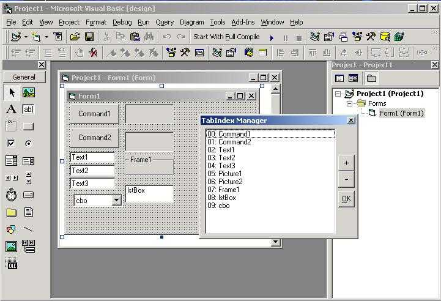



## TabIndex Manager  \*BUG FIXED\*

### Description

TabIndexManager (*array of controls bug fixed*) is a add-in for Visual Basic IDE that control the TabIndex property of the controls in the selected form. *A MUST SEE CODE !!!* ..... Special thanks to my friend Marcelo Ivan Martin. ................................................................................................................................................. *** PLEASE DON´T FORGET TO VOTE ! ***
 
### More Info
 
Compile and close the project. When you open your Visual Basic again, it will show in the "Add-ins" menu ...

             |
---                |---
**Submitted On**   |2001-12-20 11:13:12
**By**             |[Eduardo Schoedler](https://github.com/Planet-Source-Code/PSCIndex/blob/master/ByAuthor/eduardo-schoedler.md)
**Level**          |Advanced
**User Rating**    |4.7 (33 globes from 7 users)
**Compatibility**  |VB 5\.0, VB 6\.0
**Category**       |[Custom Controls/ Forms/  Menus](https://github.com/Planet-Source-Code/PSCIndex/blob/master/ByCategory/custom-controls-forms-menus__1-4.md)
**World**          |[Visual Basic](https://github.com/Planet-Source-Code/PSCIndex/blob/master/ByWorld/visual-basic.md)
**Archive File**   |[TabIndex\_M4319912202001\.zip](https://github.com/Planet-Source-Code/eduardo-schoedler-tabindex-manager-bug-fixed__1-29975/archive/master.zip)

